# Voice Canvas使い方

起動のしかたはREADMEを見てください。操作の流れは[ダイジェスト動画（3分・音声つき）](media/voice-canvas-demo.mp4)でも見られます。

- [はじめに](#intro)
- [元の音声を用意する](#source)
- [VOICEVOXが見つからないとき](#voicevox)
- [声を設定する](#design)
- [変換して聴き比べる・仕上げて保存する](#convert)
- [アンカー（声の材料）を増やす・整理する](#anchors)
- [素材ツールで素材を整える](#tools)
- [そのほかの機能](#more)
- [困ったとき](#faq)
- [権利とクレジット](#rights)

## はじめに

声のデザインを、もっと自由に。

Voice Canvas（声のCanva）は、声の特徴をスライダーで決めて、音声をその声に変換するアプリです。話す内容・テンポ・抑揚は元の音声のまま、声質だけが変わります。誰でも無料で使えるオープンソース（MITライセンス）のβ版です。

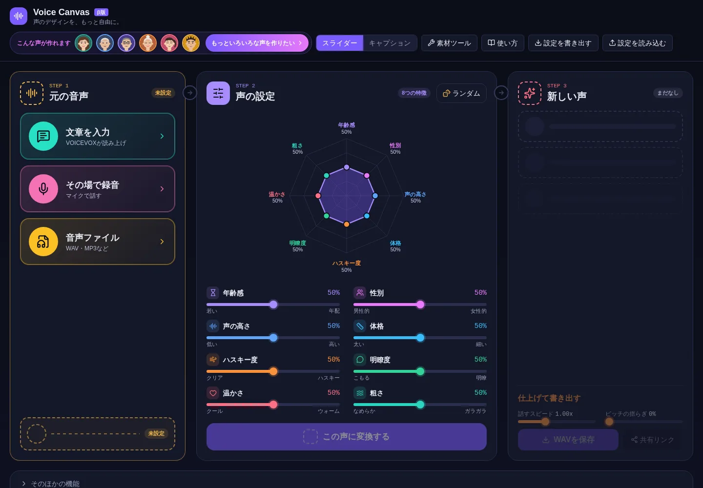
左から「元の音声」「声の設定」「新しい声」の順に並んでいます。列のあいだの矢印は、前の列の準備ができると色がつきます。

声づくりの流れは次のとおりです。

1. 元の音声を用意する。読み上げ、録音、音声ファイルから、話す内容を用意します。
2. 声を設定する。8つの特徴を動かして、作りたい声を決めます。
3. 変換して聴く。設定を変えながら聴き比べ、気に入った声を保存します。

声の変換にはSeed-VCを使っています。材料になるのは「アンカー」と呼ぶ実在の話者の声です。同梱の69人分のアンカーから、設定に近い順に最大4人までを自動で選んで混ぜ、目標の声を作ります。

GPUは必要ありません。CPUでは、変換1回に1〜数分ほどかかります。

## 元の音声を用意する

### 読み上げ・録音・ファイルから選ぶ

元の音声には、変換後に話してほしい内容を用意します。話すテンポや抑揚も引き継がれるので、元の話し方にも気を配って用意してください。

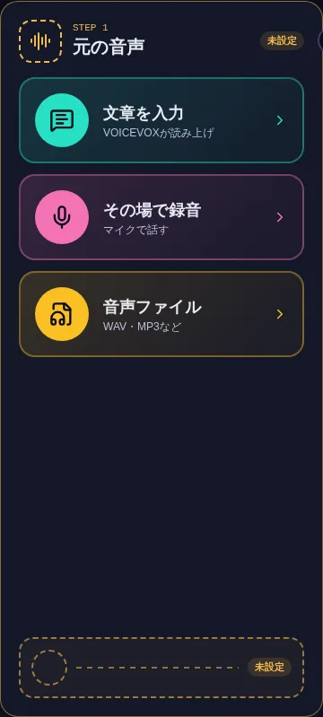
「文章を入力」「その場で録音」「音声ファイル」のカードから方法を選びます。列の下にある波形の枠が、用意した音声の受け皿です。

- 「文章を入力」では、入力した文章をVOICEVOXが読み上げます。
- 「その場で録音」では、マイクを使います。丸いボタンで録音を始め、もう一度押して止めます。
- 「音声ファイル」では、WAV・MP3などのファイルをドロップするか、選んで入れます。手元に音声がなければ、「手元に無ければ、サンプル音声を使う」で同梱の音声を使えます。

音声が入ると、受け皿は「OK」になります。空のあいだは点線の枠に「未設定」と表示され、「この声に変換する」は押せません。

方法を切り替えてから戻ると、その方法で前に用意した音声が戻ります。

### 文章を読み上げてもらう

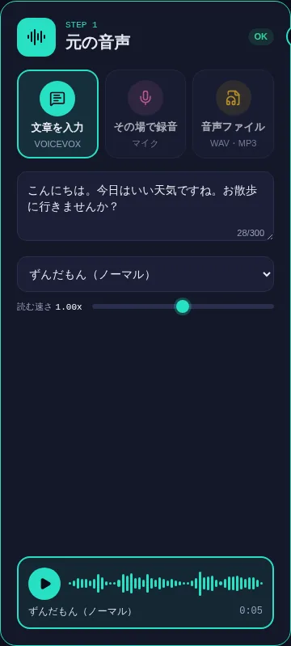
文章の入力欄と、話者・「読む速さ」の設定を見てください。用意ができたら「読み上げる」を押します。

1. 300文字までの文章を入れます。
2. 話者と「読む速さ」を選びます。
3. 「読み上げる」を押します。

文章や話者を変えると、前の読み上げは使えなくなり、受け皿が空に戻ります。変更後は、もう一度「読み上げる」を押してください。

VOICEVOXが見つからない場合は、[次の章](#voicevox)を見てください。

## VOICEVOXが見つからないとき

文章の読み上げには、無料の読み上げソフトVOICEVOXが必要です。Voice Canvasには同梱していないので、[VOICEVOX公式サイト](https://voicevox.hiroshiba.jp/)から入手してインストールしてください（Windows・Mac・Linux）。案内の「VOICEVOXをダウンロード」からも開けます。

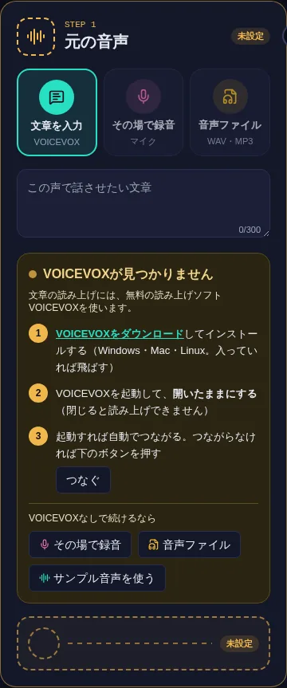
「VOICEVOXが見つかりません」の案内には、「つなぐ」と、VOICEVOXを使わずに続けるための選択肢があります。読み上げ以外の方法を使いたいときは、案内の下側を見てください。

VOICEVOXは開いたままにしておきます。閉じると、文章を読み上げられません。Voice Canvasは5秒ごとに接続を確かめているので、VOICEVOXが使える状態になれば自動でつながります。つながらないときは「つなぐ」を押してください。

読み上げを使わずに進めることもできます。「VOICEVOXなしで続けるなら」の下にある「その場で録音」「音声ファイル」「サンプル音声を使う」から選んでください。

別のPCや別のポートでVOICEVOXを動かしている場合の設定は、[README](../../../README.md)の「VOICEVOXとの連携」を参照してください。

## 声を設定する

### グラフとスライダーで声を変える

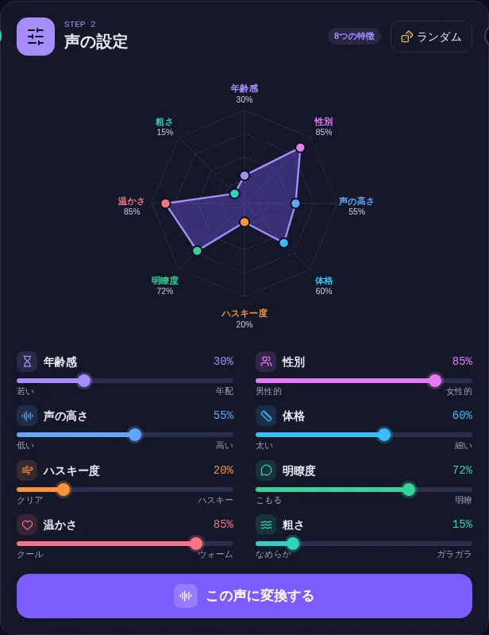
グラフの点と、その下のスライダーは連動しています。点をドラッグしても、スライダーを動かしても、同じ設定を変えられます。

声の特徴は、次の8つです。それぞれ0〜100%の範囲で設定します。

| 特徴 | 左端 | 右端 |
|---|---|---|
| 年齢感 | 若い | 年配 |
| 性別 | 男性的 | 女性的 |
| 声の高さ | 低い | 高い |
| 体格 | 太い | 細い |
| ハスキー度 | クリア | ハスキー |
| 明瞭度 | こもる | 明瞭 |
| 温かさ | クール | ウォーム |
| 粗さ | なめらか | ガラガラ |

まずは気になる特徴を動かし、変換して聴いてみてください。設定を探すきっかけがほしいときは、「ランダム」で全部の値をばらばらにできます。

### 「こんな声が作れます」から試す

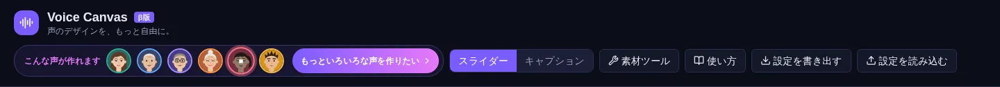
画面上部の顔アイコンを押すと、その声のサンプルが流れ、グラフとスライダーにもその声の設定が入ります。

用意されているのは、次の6つです。

- ナチュラル女性
- 落ち着いた男性
- 知的な語り口
- 温かいナレーション
- 親しみやすい声
- 活発な男性

気になる声を選び、そこからスライダーで好みに近づけることもできます。

材料になる声を増やしたいときは、隣の「もっといろいろな声を作りたい」からアンカー管理へ進めます。詳しくは[アンカーの章](#anchors)を見てください。

## 変換して聴き比べる・仕上げて保存する

### 設定した声に変換する

元の音声と声の設定が用意できたら、「この声に変換する」を押します。

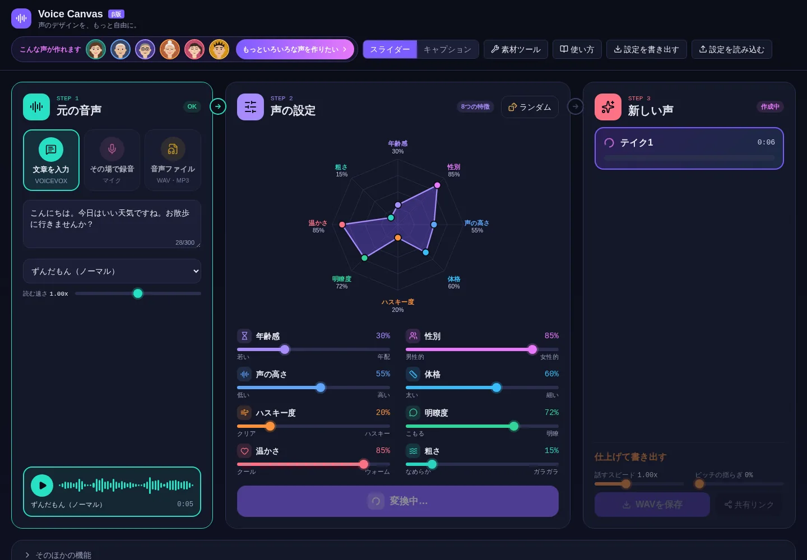
右の「新しい声」の列に、変換の経過時間が表示されます。変換を待つあいだも画面は使えます。

CPUでは、1回の変換に1〜数分ほどかかります。参考として、開発環境のCPUでは、既定の設定で3.5秒の文の変換に約2分、10秒の文に約3分半かかりました。

### テイクを聴き比べる

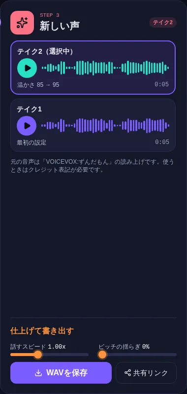
変換するたびに、右の列に「テイク」が増えます。前のテイクから変えた設定も「温かさ 70 → 85」のように表示されます。

テイクを押すと、そのテイクが選ばれます。設定の違いを見ながら聴き比べ、気に入ったものを選んでください。

同じ元の音声でスライダーを変えて変換すると、声質の違いを比べられます。

### 仕上げて保存する

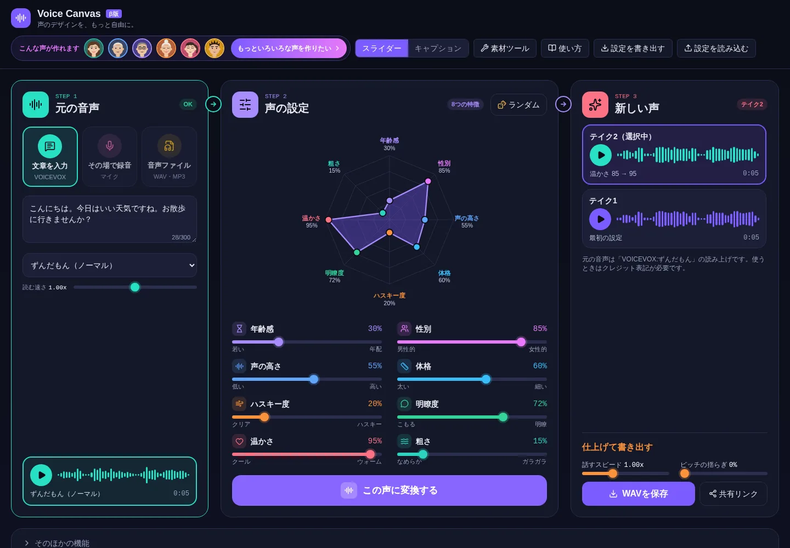
「仕上げて書き出す」では、選んだテイクの速さやピッチの揺らぎを調整できます。保存するときは「WAVを保存」を使います。

仕上げでは、「話すスピード」を0.5〜2.0倍、「ピッチの揺らぎ」を0〜100%の範囲で調整できます。どちらも、選んだテイクに再変換なしで掛け直せます。

「共有リンク」は、選んだテイクのスライダー設定をURLにしてコピーします。声の設定を共有したいときに使ってください。

元の音声にVOICEVOXの読み上げを使った場合は、クレジット表記が必要と表示されます。音声を使う際は、[権利とクレジット](#rights)も確認してください。

## アンカー（声の材料）を増やす・整理する

### アンカーは新しい声の材料

アンカーは、人が話している12秒ほどの音声で、声づくりの材料になります。さまざまなアンカーを登録するほど、作れる声が広がります。同梱されているのは、Common Voice日本語の45人分と、JVNV感情音声の24人分、合計69人分です。

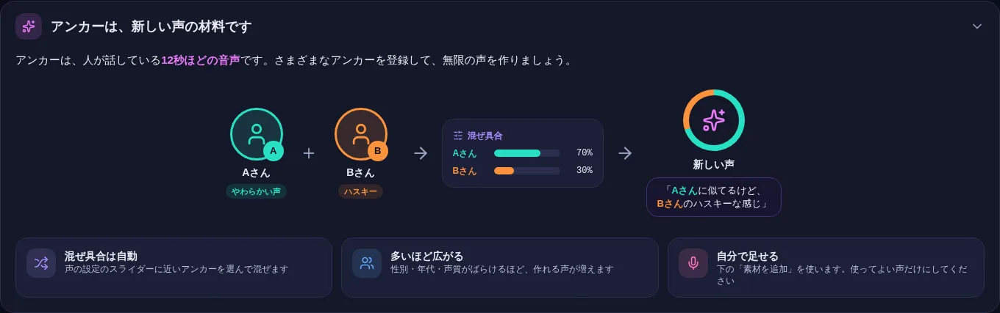
「アンカーは、新しい声の材料です」の図は、異なる声の特徴を混ぜて新しい声を作る様子を示しています。見出しを押すと、この説明を折りたためます。

混ぜ具合は自動で決まります。声の設定のスライダーに近いアンカーを選んで混ぜるので、自分で一人ずつ選ぶ必要はありません。材料になる声が増えるほど、作れる声の幅が広がります。

画面上部には、使用できる人数と状態が表示されます。同梱の69人が使える状態なら、「69人 登録済み。声のデザインに使えます。」と表示されます。

声を作るには、使用中のアンカーが3人以上必要です。足りないときは、上部に黄色の案内が出ます。

### 声の材料を追加する

登録するのは、使ってよい声だけにしてください。本人の同意がある録音や、CC0のコーパスなどを使います。

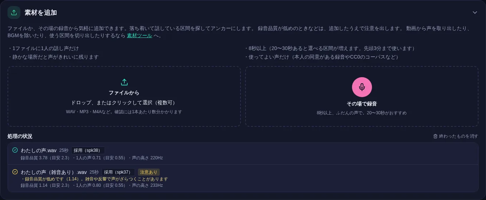
「素材を追加」では、「ファイルから」と「その場で録音」を選べます。追加した音声の確認結果は「処理の状況」に並びます。

「ファイルから」では、音声ファイルをドロップするか、選んで追加します。複数のファイルも入れられます。

「その場で録音」では、8秒までの進み具合が表示されます。8秒を超えると緑になり、「止めると確認に送ります」と表示されます。ふだんの声で、20〜30秒ほど話すのがおすすめです。使うのは音声の先頭3分までです。

追加した音声からは、落ち着いて話している区間を自動で選びます。確認にかかる時間は、CPUで1本あたり数分です。

確認で不採用になるのは、次のどちらかの場合です。

- 音声が8秒未満。
- 話し声が見つからない。

1人だけの声かどうかや、録音品質も確認します。これらが目安に届かなくても採用されますが、「注意」が付きます。「処理の状況」には、採用・理由つきの不採用・注意ありの結果が並びます。

### 一覧から探す・聴く・外す

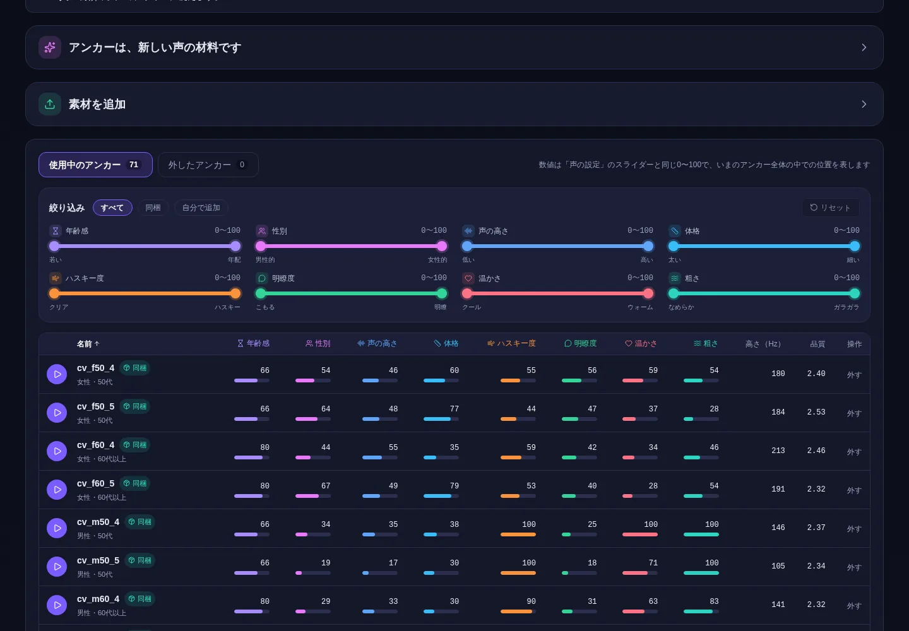
「使用中のアンカー」と「外したアンカー」のタブで一覧を切り替えます。出どころや特徴の範囲を使うと、探したい声を絞り込めます。

出どころは「すべて」「同梱」「自分で追加」から選べます。8つの特徴ごとの範囲は、2つのつまみで絞り込みます。「リセット」で絞り込みを戻せます。

一覧の特徴の値は0〜100で、いまのアンカー全体の中での位置を表します。アンカーを追加したり外したりすると、値も変わります。

列の見出しを押すと並べ替えられます。声のデザイン画面から来たときは「いまの声の設定に近い順」になり、近さの列も表示されます。1ページの人数は20・50・100人から選べます。

▶を押すと、アンカーに使っている4秒の音声を試聴できます。

使わない声は「外す」で声づくりの対象から外せます。ファイルは消えません。「外したアンカー」タブで「戻す」を押せば、また使えます。同梱のアンカーも外せますが、再起動しても自動では戻りません。

0人になるまで外すことはできますが、3人未満になると変換は止まります。使いたいアンカーを戻して、3人以上にしてください。

### 自分で追加した声と「注意」を確認する

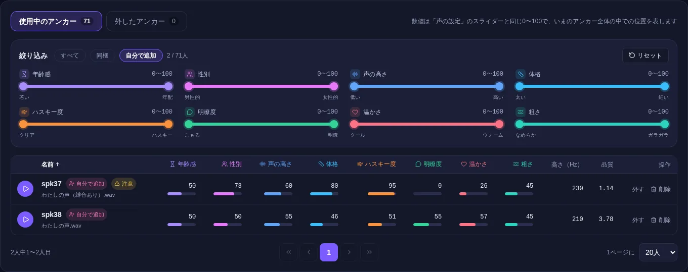
この画面では「自分で追加」で絞り込んでいます。名前の横にある「注意」にマウスを乗せると、理由を確認できます。

名前の横のバッジで、「同梱」か「自分で追加」かを見分けられます。「注意」は、録音品質が低めなど、確認で目安に届かなかった項目があることを示します。

素材ツールの「BGM・雑音の除去」を通すと、録音品質が改善することがあります。気に入らなければ外すこともできます。

「削除」ができるのは、自分で追加したアンカーだけです。完全に消えて元に戻せないので、あとで使う可能性がある声は「外す」を使ってください。同梱のアンカーは削除できません。

外す・戻す・削除を行ったあとも、その行はその場に残り、「外しました・戻す」などと表示されます。操作のたびに押す場所がずれないようになっています。

## 素材ツールで素材を整える

画面上部の「素材ツール」から開きます。左でツールを選び、中央で作業し、できた音声を右の「素材トレイ」にためていきます。

たとえば、動画の声をアンカーにしたいときは、音声を抽出し、BGMを除き、必要な範囲をカットしてからアンカーに追加できます。

### 素材トレイを使う

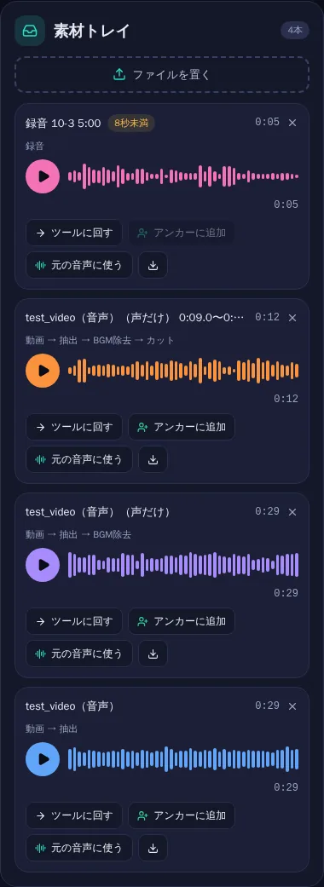
右の「素材トレイ」に、作った音声がカードで並びます。カードには「動画 → 抽出 → BGM除去」のように、通ってきた道のりも表示されます。

トレイ上部の「ファイルを置く」から、音声や動画を直接入れることもできます。

各カードでは、次の操作ができます。

- ▶で試聴します。
- 「ツールに回す」で、BGM・雑音の除去、カット、ピッチ、結合へ渡します。
- 「アンカーに追加」で、アンカー管理と同じ確認へ送ります。
- 「元の音声に使う」で、声のデザイン画面へ移り、元の音声に入れます。
- 保存のボタンで、音声をファイルに保存します。
- ×で、トレイから消します。

8秒未満の音声には「8秒未満」と表示され、「アンカーに追加」は押せません。

トレイの音声は、ページを移っても残ります。ただし、再読み込みすると消えるので、残しておきたい音声は保存してください。

### 動画や音声から取り出す

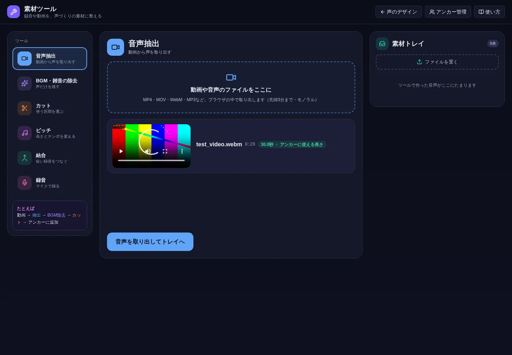
「音声抽出」でファイルを入れたら、「音声を取り出してトレイへ」を使います。取り出した音声は右のトレイに入ります。

MP4・MOV・WebM・MP3など、ブラウザが再生できる形式を扱えます。処理はブラウザの中で行い、先頭3分までをモノラルの音声として取り出します。

### BGMや雑音を除く

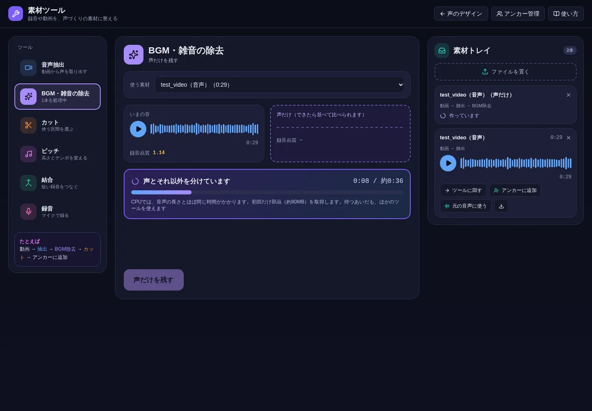
「BGM・雑音の除去」では、「声だけを残す」で処理を始めます。処理中も、ほかのツールを使えます。

この処理にはDemucsを使います。初回だけ約80MBの部品を取得します。

CPUでは音声の長さとほぼ同じ時間がかかり、30秒の音声で約40秒が目安です。

### 処理前後を比べる

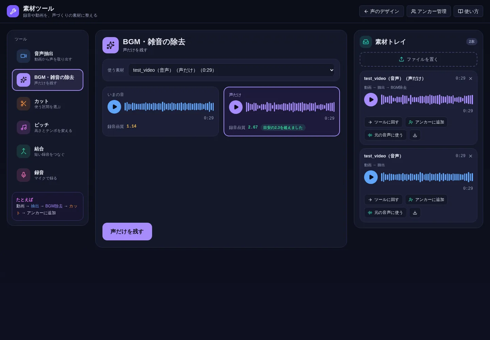
結果には、処理前と処理後の録音品質が並びます。数値とあわせて音声も聴き比べてください。

録音品質の目安は2.3です。BGMを混ぜた話し声では、1.14から2.6前後に改善した例があります。

### 必要な範囲をカットする

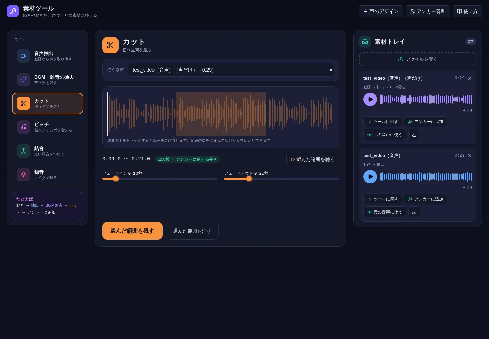
波形の上で使いたい範囲を選びます。選んだ長さが8秒以上になると、「アンカーに使える長さ」と表示されます。

最初は、真ん中あたりの12秒が選ばれています。ドラッグで選び直し、範囲の端をつまんで調整できます。

「選んだ範囲を聴く」で確かめてから、「選んだ範囲を残す」か「選んだ範囲を消す」を選びます。フェードイン・フェードアウトも付けられます。

### 高さとテンポを変える

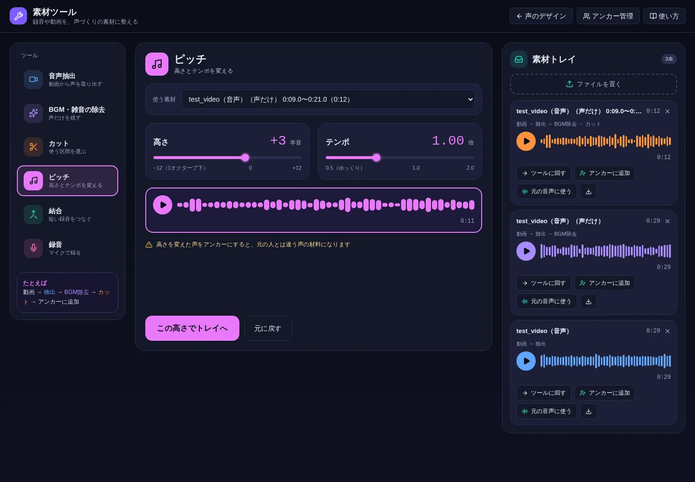
「ピッチ」では、「高さ」と「テンポ」を調整します。「この設定で試聴する」で、トレイに入れる前に確かめられます。

「高さ」は−12〜+12半音、「テンポ」は0.5〜2.0倍の範囲で変えられます。テンポを変えても、高さは変わりません。

試聴してよければ「この高さでトレイへ」を押します。設定を戻したいときは「元に戻す」を使います。

高さを変えた声をアンカーにすると、元の人とは違う声の材料になります。

### マイクで録音する

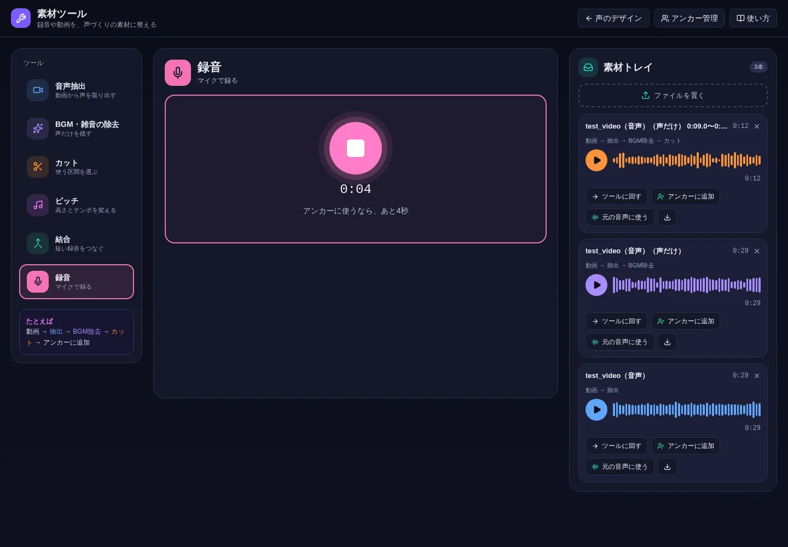
「録音」では、マイクで録った音声をトレイへ入れられます。トレイに入れたあと、カットなどのツールに回せます。

使うのは先頭3分までです。アンカー用に録るなら、ふだんの声で20〜30秒ほど話すのがおすすめです。

### 複数の音声をつなぐ

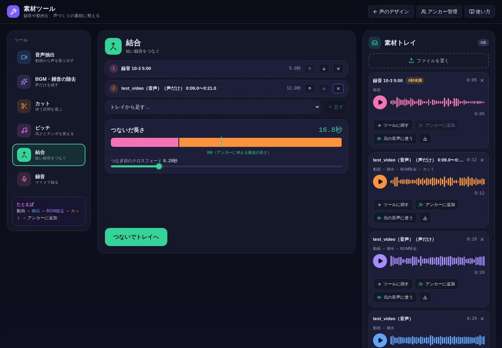
「結合」では、「トレイから足す」で音声を並べます。「つないだ長さ」と8秒の目印で、アンカーに使える長さかを確認できます。

↑↓で順番を変えられます。つなぎ目で音を重ねるクロスフェードは、0〜1秒で設定できます。

2本以上並べると「つないでトレイへ」が使えます。短い録音を集めて8秒以上にし、アンカーに使いたいときにも役立ちます。

## そのほかの機能

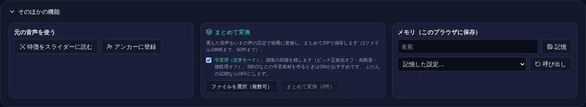
画面下部の「そのほかの機能」を押すと、追加の機能が開きます。元の音声の特徴を読む機能や、設定を保存するメモリがあります。

- 「特徴をスライダーに読む」で、元の音声の特徴をスライダーへ読み込みます。
- 「アンカーに登録」で、元の音声をアンカー管理と同じ確認へ送ります。
- 「まとめて変換」で、音声をまとめて変換できます。
- 「メモリ」に、このブラウザで設定を保存し、呼び出せます。

画面上部には、設定をファイルで扱うための機能もあります。「設定を書き出す」でスライダーや話す速さなどをJSONファイルに保存し、「設定を読み込む」で読み込めます。

このマニュアルは、画面右上の「使い方」から開けます。

## 困ったとき

### 変換に時間がかかります

CPUでは、1本の変換に1〜数分ほどかかります。右の列に表示される経過時間を見ながら待ってください。待つあいだも画面は使えます。

### 「この声に変換する」が押せません

元の音声の受け皿を確認してください。「未設定」のあいだは変換できません。

文章や話者を変えた場合は、前の読み上げが使えなくなっています。もう一度「読み上げる」を押してください。

### 「アンカーが足りません」と表示されます

使用中のアンカーが3人以上必要です。アンカー管理で外したアンカーを戻すか、新しく追加してください。詳しくは[アンカーの章](#anchors)を見てください。

### アンカーに「注意」が付きました

録音品質が低めなど、確認で目安に届かなかった項目があります。「注意」にマウスを乗せると理由を確認できます。

素材ツールの「BGM・雑音の除去」で改善することがあります。気に入らなければ外すことも、自分で追加したものなら削除することもできます。

### マイクが使えません

ブラウザでマイクの使用を許可してください。

### 動画が読み込めません

ブラウザが再生できる形式でないと読み込めません。ファイルの形式を確認してください。

### VOICEVOXにつながりません

VOICEVOXを開いたままにして、「つなぐ」を押してください。詳しくは[VOICEVOXが見つからないとき](#voicevox)を見てください。

WindowsのWSLの中でVoice Canvasを動かしている場合は、WSLの設定を変える必要があります。手順はREADMEの「Windows（WSL2）で使う」にあります。

別のPCや別のポートで動かしている場合は、Webの環境変数`VOICEVOX_URL`の設定が必要です。既定は`http://127.0.0.1:50021`です。設定については[README](../../../README.md)を参照してください。

### 素材トレイの音声が消えました

素材トレイの音声はページを移っても残りますが、再読み込みすると消えます。残しておきたい音声は、カードから保存してください。

## 権利とクレジット

VOICEVOXの読み上げを元にした音声を使うときは、「VOICEVOX:ずんだもん」のように、使った話者のクレジット表記が必要です。VOICEVOXと各キャラクターの利用規約に従ってください。

アンカーには、本人の同意がある録音など、使ってよい声だけを登録してください。

同梱アンカーのCommon VoiceはCC0、JVNVはCC BY-SA 4.0です。JVNVは出典表示が必要で、改変・再配布するときは同じライセンスで配布します。JVNVのアンカーを混ぜて作った試聴音声も含みます。

Common Voiceの話者の身元を特定しようとしないでください。

音声素材やライセンスの詳細は、[READMEの「音声素材とライセンス」](../../../README.md#音声素材とライセンス)を確認してください。